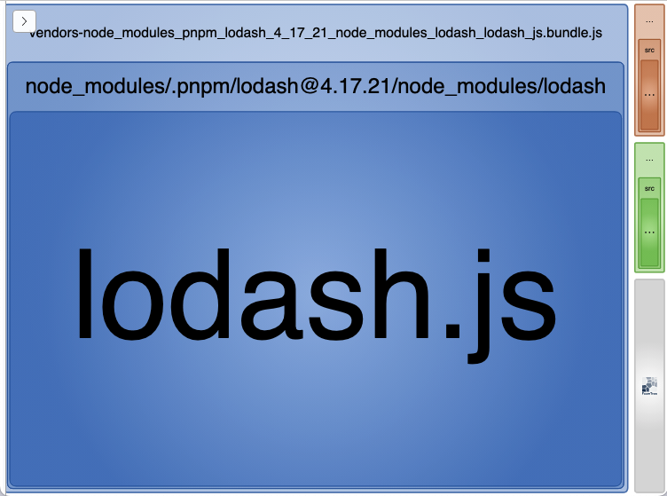

```js
module.exports = {
  mode: 'development',
  entry: {
    index: './src/index.js',
    another: './src/another-module.js',
  },
  output: {
    filename: '[name].bundle.js',
    path: path.resolve(__dirname, 'dist'),
  },
  optimization: {
    //
    // The SplitChunksPlugin allows us to extract common dependencies
    // into an existing entry chunk or an entirely new chunk.
    //
    // Doc: https://webpack.js.org/plugins/split-chunks-plugin/
    //
    splitChunks: {
      // Providing all can be particularly powerful, because it
      // means that chunks can be shared even between async and
      // non-async chunks.
      // Ref: https://webpack.js.org/plugins/split-chunks-plugin/#splitchunkschunks
      chunks: 'all',
    },
  },
};
```


- All (**567.75 KB**)
- vendors-node_modules_pnpm_lodash_4_17_21_node_modules_lodash_lodash_js.bundle.js (**550.03 KB**)
- index.bundle.js (**8.92 KB**)
- another.bundle.js (**8.8 KB**)


