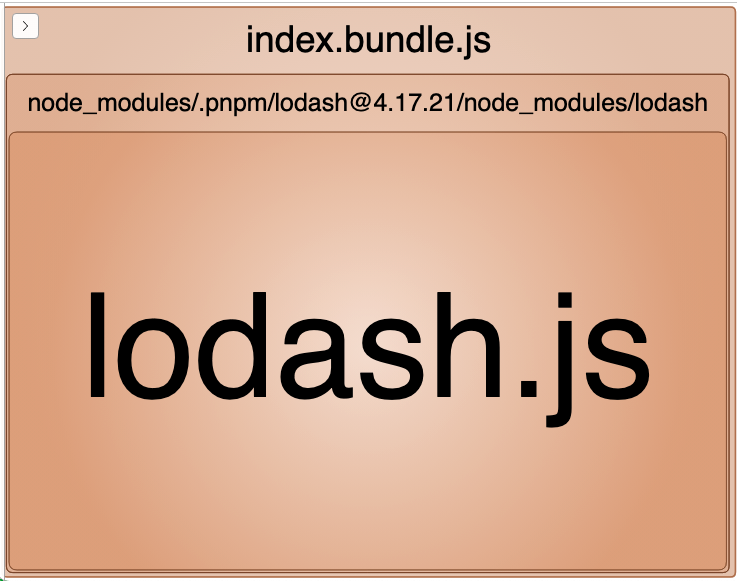

```js
import _ from 'lodash';

function getComponent() {
  return import('lodash')
    .then(({ default: _ }) => {
      //
      // The reason we need default is that since webpack 4, when
      // importing a CommonJS module, the import will no longer
      // resolve to the value of module.exports, it will instead
      // create an artificial namespace object for the CommonJS
      // module. For more information on the reason behind this,
      // read:
      // https://medium.com/webpack/webpack-4-import-and-commonjs-d619d626b655
      //
      const element = document.createElement('div');

      element.innerHTML = _.join(['Hello', 'webpack'], ' ');
       return element;
    })
    .catch((error) => 'An error occurred while loading the component');
}

getComponent().then((component) => {
  document.body.appendChild(component);
});
```


- index.bundle.js (573 KB)

  


