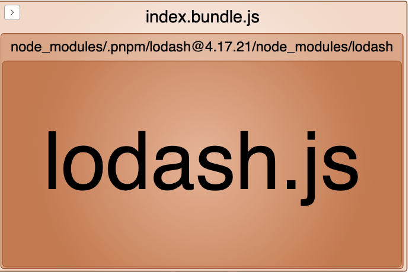

```js
import _ from 'lodash';


function getComponent() {
  // ...
}


let button = document.createElement('button')
button.innerHTML = 'getComponent'
button.addEventListener('click', e => {
  let script = document.createElement("script");
  script.src = "script.js";
  document.head.appendChild(script);

  getComponent().then((component) => {
    document.body.appendChild(component);
  });
})


document.body.appendChild(button)
```


- All (**573 KB**)

- index.bundle.js (**573 KB**)

  

