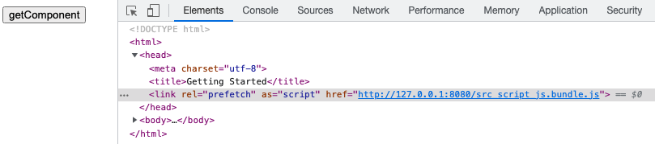
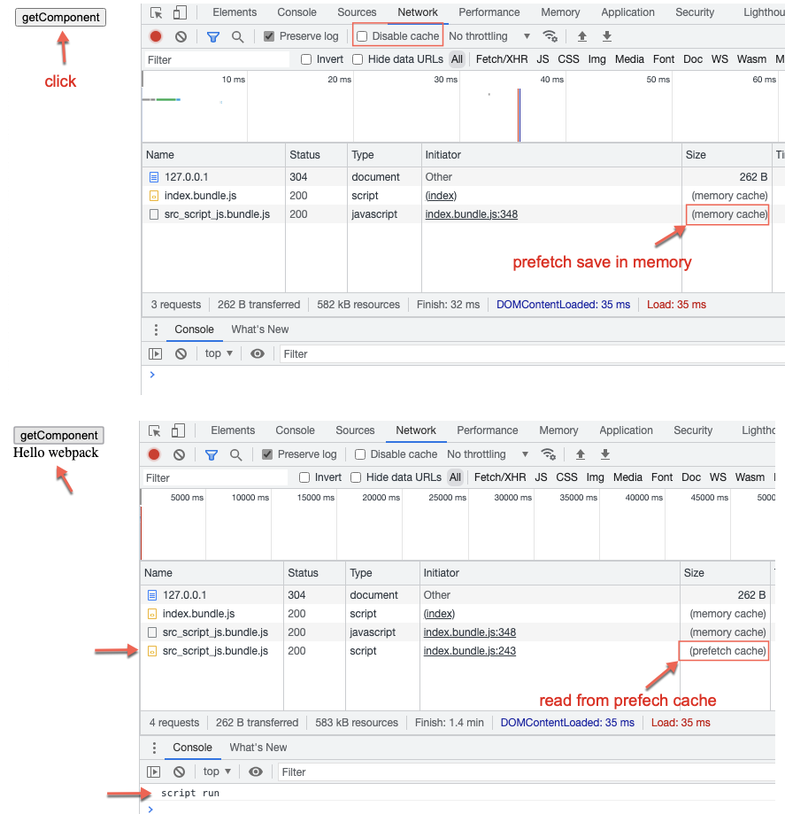
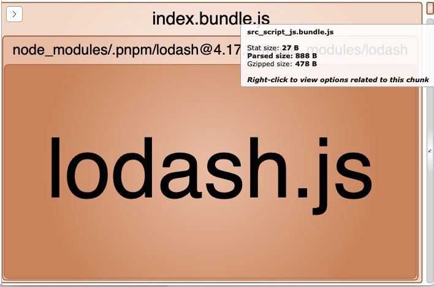

```js
import _ from 'lodash';


function getComponent() {
  // ...
}


let button = document.createElement('button')
button.innerHTML = 'getComponent'
button.addEventListener('click', e => {
  //
  // The inline preload directive `/* webpackPrefetch: true */` will inject:
  //
  //   <link rel="prefetch" as="script" href="http://127.0.0.1:8080/src_script_js.bundle.js">
  //
  // into the header.
  //
  import(/* webpackPrefetch: true */ './script.js');
  
  getComponent().then((component) => {
    document.body.appendChild(component);
  });
})


document.body.appendChild(button)

```

The inline preload directive `/* webpackPrefetch: true */` will inject:

```
<link rel="prefetch" as="script" href="http://127.0.0.1:8080/src_script_js.bundle.js">
```

into the header



Browser will then prefetch the bundle `src_script_js.bundle.js` and save it in cache. 

When user click button `getComponent` it will is read from this cache:




---

Bundle analyse

- All (**568.57 KB**)
- index.bundle.js (**567.7 KB**)
- src_script_js.bundle.js (**888 B**)


