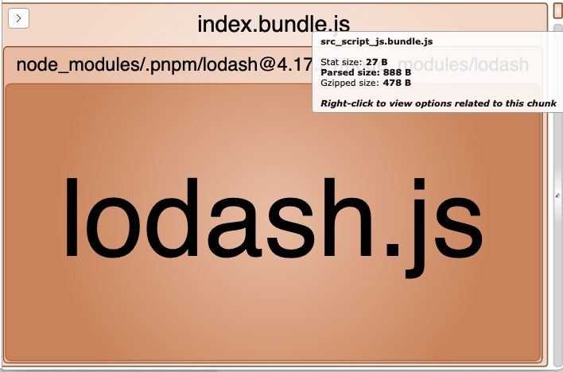

```js
import _ from 'lodash';


function getComponent() {
  // ...
}


let button = document.createElement('button')
button.innerHTML = 'getComponent'
button.addEventListener('click', e => {
  import(/* webpackPrefetch: true */ './script.js');
  
  getComponent().then((component) => {
    document.body.appendChild(component);
  });
})


document.body.appendChild(button)

```


- All (**568.57 KB**)
- index.bundle.js (**567.7 KB**)
- src_script_js.bundle.js (**888 B**)


